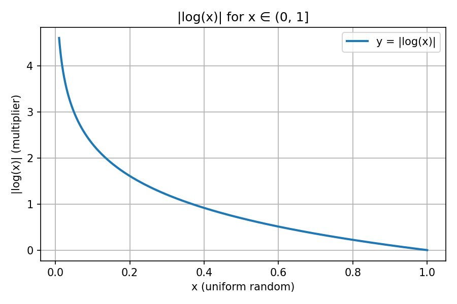

# Read-Through with XFetch Early Recomputation

> Hashset-based read-through cache with reverse-pointer O(1) invalidation and XFetch probabilistic early expiration to prevent cache stampede.

| Property | Value |
|----------|-------|
| **Cache model** | Redis hashset per DAO method + parameter scope |
| **Read path** | Read-through — transparent population on miss via `_fetchObjectMap` |
| **Write path** | Cache-aside — explicit eviction via `_destroyObjectCache` / `_deleteCacheByKey` |
| **Invalidation** | O(1) via reverse pointer (`md5 → keyMap → DEL`) |
| **Stampede prevention** | XFetch probabilistic early expiration (Vattani et al., 2015) |
| **Consumers** | 47 DAO subclasses, Pager, SessionTokenStoreHandler |

---

## Table of Contents

1. [Introduction & Overview](#1-introduction--overview)
2. [DaoCacheTrait — The Foundation](#2-daocachetrait--the-foundation)
3. [AbstractDao — Cache Integration](#3-abstractdao--cache-integration)
4. [The Three Invalidation Strategies](#4-the-three-invalidation-strategies)
5. [Pager & getAllPaginated Pattern](#5-pager--getallpaginated-pattern)
6. [SessionTokenStoreHandler — Non-DAO Consumer](#6-sessiontokenstorehandler--non-dao-consumer)
7. [XFetch — Probabilistic Early Expiration](#7-xfetch--probabilistic-early-expiration)
8. [XFetch in Practice](#8-xfetch-in-practice)

---

## 1. Introduction & Overview

### What the cache layer does

When a DAO method executes a SQL query, the result set is serialized and stored in Redis under a namespaced hashset key. On subsequent calls with identical parameters, the result is deserialized directly from Redis without touching the database. Each entry carries a TTL; invalidation is triggered explicitly by write operations.

### Architecture

```
Controller / Service
        │
        ▼
  DAO subclass
   (e.g., Jobs\MetadataDao)
        │
        ▼
  AbstractDao::_fetchObjectMap()
   ├── auto-generates keyMap via debug_backtrace()
   ├── builds query fingerprint: queryString + params + fetchClass
   └── calls DaoCacheTrait methods
              │
              ├── _getFromCacheMap(keyMap, fingerprint) ──► Redis HGET
              │        │
              │        ├── XFetchEnvelope? ─► _shouldRecompute()
              │        │       ├── YES → treat as miss (early recompute)
              │        │       └── NO  → return envelope.value
              │        │
              │        └── raw array? → return as-is (backward compat)
              │
              └── on miss: execute PDO, fetch rows  [measures δ]
                       │
                       └── _setInCacheMap(keyMap, fingerprint, result)
                                ├── XFetch active? → wrap in XFetchEnvelope(value, now, δ)
                                └── Redis HSET + EXPIRE + SETEX
```

```
Invalidation path:
  DAO write method (upsert/save/delete)
        │
        ├── _destroyObjectCache(stmt, fetchClass, params)  ← surgical
        │         └── _deleteCacheByKey(md5, isReverseKeyMap=true)
        │                   └── GET md5 → keyMap → DEL keyMap + DEL md5
        │
        └── _deleteCacheByKey(keyMap, isReverseKeyMap=false)  ← nuclear
                  └── DEL keyMap  (direct)
```

### Three Consumers

| Consumer | Class | Use Case |
|----------|-------|----------|
| **AbstractDao** | `abstract class AbstractDao uses DaoCacheTrait` | SQL query result caching — inherited by ~47 DAO subclasses |
| **Pager** | `class Pager uses DaoCacheTrait` | Paginated query caching — cache is opt-in, keyed explicitly |
| **SessionTokenStoreHandler** | `class SessionTokenStoreHandler uses DaoCacheTrait` | Login cookie token storage — no SQL, uses Redis hashset as a pure KV store |

### Key Design Decisions

- **Hashset-based storage**: All results for a given DAO method + parameter combination live inside one Redis hashset. This groups related cache entries under a single namespace, making it possible to invalidate all of them with a single `DEL`.
- **Reverse pointer**: Every stored entry creates a second Redis key (`md5` → `keyMap`), enabling surgical invalidation without knowing the keyMap name.
- **Auto-generated keyMaps**: `AbstractDao` uses `debug_backtrace()` to derive the keyMap name from the calling class and method. This eliminates manual keyMap management for the ~47 DAO subclasses.
- **Opt-in TTL**: Cache is disabled by default (`$cacheTTL = 0`). DAOs explicitly opt in via `setCacheTTL($seconds)` chained before read calls.
- **Probabilistic early expiration**: Each cache hit runs the XFetch algorithm to determine if the entry should be refreshed before its TTL expires, preventing cache stampede without coordination or distributed locks.

---

## 2. DaoCacheTrait — The Foundation

`lib/Model/DataAccess/DaoCacheTrait.php`

The trait owns the Redis connection and all low-level cache operations. It is consumed by three classes: `AbstractDao`, `Pager`, and `SessionTokenStoreHandler`.

### Properties

```php
protected static ?Client $cache_con;   // Shared Redis client (Predis)
protected int $cacheTTL = 0;           // 0 = cache disabled
```

`$cache_con` is `static` — all instances of a given class share the same connection within a request.

### Methods

| # | Method | Visibility | Responsibility |
|---|--------|-----------|----------------|
| 1 | `_cacheSetConnection()` | protected | Lazy Redis connection init. Creates a `RedisHandler` and calls `getConnection()`. Sets `self::$cache_con`. On failure, sets it to `null` and re-throws. |
| 2 | `_logCache(string $type, string $key, mixed $value, string $sqlQuery)` | protected | Structured debug log to the `query_cache` channel. Can be overridden per consumer (see §6). |
| 3 | `_getFromCacheMap(string $keyMap, string $query)` | protected | **Read**: `HGET $keyMap md5($query)`. Deserializes via `unserialize()`. Returns `null` on miss or when cache is disabled (`$cacheTTL == 0`). Short-circuits immediately if `AppConfig::$SKIP_SQL_CACHE` is `true`. |
| 4 | `_setInCacheMap(string $keyMap, string $query, array $value)` | protected | **Write**: Performs THREE Redis operations (see below). No-ops if `$cacheTTL == 0`. |
| 5 | `setCacheTTL(?int $cacheSecondsTTL)` | public | Fluent TTL setter. Returns `$this` for method chaining. Respects `AppConfig::$SKIP_SQL_CACHE` — if the kill switch is on, the TTL is left at `0` (cache stays disabled). |
| 6 | `_serializeForCacheKey(array $params)` | protected | Casts ALL array values to `(string)` before calling `serialize()`. Ensures `1` and `"1"` produce the same cache key (type-safe determinism). |
| 7 | `_removeObjectCacheMapElement(string $keyMap, string $keyElementName)` | protected | **Surgical field removal**: `DEL md5($keyElementName)` (reverse pointer) + `HDEL $keyMap [md5($keyElementName)]` (one field from hashset). The only way to remove a single entry without destroying the entire hashset. |
| 8 | `_deleteCacheByKey(string $key, ?bool $isReverseKeyMap = true)` | protected | **Two modes**: `true` → reverse lookup (`GET $key` → find hashset → `DEL hashset + DEL $key`); `false` → nuclear (`DEL $key` directly). |

### The Three Redis Operations in `_setInCacheMap`

```php
protected function _setInCacheMap(string $keyMap, string $query, array $value)
{
    if ($this->cacheTTL == 0) { return null; }

    if (isset(self::$cache_con) && !empty(self::$cache_con)) {
        $key = md5($query);
        self::$cache_con->hset($keyMap, $key, serialize($value));   // ① store result
        self::$cache_con->expire($keyMap, $this->cacheTTL);         // ② refresh hashset TTL
        self::$cache_con->setex($key, $this->cacheTTL, $keyMap);    // ③ reverse pointer
    }
}
```

**① `HSET $keyMap $md5 $serialized`** — stores the result inside the hashset under a deterministic field key.

**② `EXPIRE $keyMap $ttl`** — keeps the hashset alive. Called on every write to reset the sliding window; the hashset outlives any single entry as long as reads keep coming.

**③ `SETEX $md5 $ttl $keyMap`** — stores the reverse pointer: given `md5`, you can look up which hashset owns it. This is what `_deleteCacheByKey(md5, isReverseKeyMap=true)` uses to find and delete the parent hashset during surgical invalidation.

### Redis Data Structure

```
Redis state after one cached query:

  Key: "Jobs\MetadataDao::getByIdJob-42:mt_engine"     ← hashset (keyMap)
  Type: hash
  Fields:
    "a1b2c3d4..."  →  serialized([MetadataStruct, ...])
  TTL: 86400

  Key: "a1b2c3d4..."                                    ← reverse pointer
  Type: string
  Value: "Jobs\MetadataDao::getByIdJob-42:mt_engine"
  TTL: 86400

Lookup:
  READ:        HGET "Jobs\MetadataDao::..." "a1b2c3d4..."  → unserialize → objects
  WRITE:       HSET + EXPIRE + SETEX (see above)
  INVALIDATE:  GET "a1b2c3d4..." → "Jobs\MetadataDao::..." → DEL that hashset + DEL "a1b2c3d4..."
```

### `_serializeForCacheKey` — Why String Casting Matters

PHP's `serialize()` distinguishes types: `serialize([1])` and `serialize(["1"])` produce different strings. Bind parameters often originate from HTTP requests (strings) or domain code (integers); without normalization, equivalent queries would miss the cache depending on the call site's type. The string cast resolves this:

```php
protected function _serializeForCacheKey(array $params): string
{
    foreach ($params as $key => $value) {
        $params[$key] = (string)$value;   // int 1 → string "1"
    }
    return serialize($params);
}
```

### `setCacheTTL` and the Kill Switch

```php
public function setCacheTTL(?int $cacheSecondsTTL): static
{
    if (!AppConfig::$SKIP_SQL_CACHE) {
        $this->cacheTTL = $cacheSecondsTTL ?? 0;
    }
    return $this;
}
```

`AppConfig::$SKIP_SQL_CACHE` is a global flag (typically set in test environments or under specific deployment conditions) that silently disables caching across the entire application. When set, `setCacheTTL()` is a no-op and `$cacheTTL` stays at `0`, which causes all `_getFromCacheMap` and `_setInCacheMap` calls to short-circuit.

---

## 3. AbstractDao — Cache Integration

`lib/Model/DataAccess/AbstractDao.php`

`AbstractDao` is the base class for all DAO subclasses (~47 in `lib/`). It uses `DaoCacheTrait` and exposes two cache-related methods to subclasses: `_fetchObjectMap` (cache-through read) and `_destroyObjectCache` (surgical invalidation).

### `_fetchObjectMap` — The Cache-Through Read

```php
protected function _fetchObjectMap(
    PDOStatement $stmt,
    string $fetchClass,
    array $bindParams,
    string $keyMap = null
): array
```

**Step-by-step flow:**

**Step 1 — Derive keyMap** (if not provided):

```php
if (empty($keyMap)) {
    $trace = debug_backtrace(!DEBUG_BACKTRACE_PROVIDE_OBJECT | DEBUG_BACKTRACE_IGNORE_ARGS, 2);
    $keyMap = $trace[1]['class'] . "::" . $trace[1]['function'] . "-" . implode(":", $bindParams);
}
```

Frame `[1]` is the *calling* method (not `_fetchObjectMap` itself). So if `MetadataDao::getByIdJob(42, 'mt_engine')` calls `_fetchObjectMap`, the auto-generated keyMap is:

```
"Model\Jobs\MetadataDao::getByIdJob-42:mt_engine"
```

**Step 2 — Build fingerprint** for the HSET field:

```php
$fingerprint = $stmt->queryString . $this->_serializeForCacheKey($bindParams) . $fetchClass;
```

This string uniquely identifies: which SQL template + which parameter values + which hydration class.

**Step 3 — Cache check:**

```php
$_cacheResult = $this->_getFromCacheMap($keyMap, $fingerprint);
if (!is_null($_cacheResult)) {
    return $_cacheResult;    // cache hit — return immediately
}
```

**Step 4 — On miss: execute and cache:**

```php
$stmt->setFetchMode(PDO::FETCH_CLASS, $fetchClass);
$stmt->execute($bindParams);
$result = $stmt->fetchAll();
$this->_setInCacheMap($keyMap, $fingerprint, $result);
return $result;
```

The result is an array of `$fetchClass` instances, stored in the hashset and returned.

### `_destroyObjectCache` — Surgical Invalidation

```php
protected function _destroyObjectCache(PDOStatement $stmt, string $fetchClass, array $bindParams): bool
{
    return $this->_deleteCacheByKey(
        md5($stmt->queryString . $this->_serializeForCacheKey($bindParams) . $fetchClass)
    );
}
```

The caller **must** pass a `PDOStatement` (obtained via `$this->_getStatementForQuery($query)`). The method reconstructs the same fingerprint that `_fetchObjectMap` stored, takes its `md5`, and uses it as the reverse pointer key to find and delete the parent hashset.

`_deleteCacheByKey` with `isReverseKeyMap=true` (the default):

```
GET md5 → keyMap name → DEL keyMap → DEL md5
```

> **Important**: `_destroyObjectCache` deletes the **entire hashset**, not just one field. Every query variation cached under the same keyMap (e.g., all calls to `getByIdJob` for user `42`) is evicted together. This is correct because a write operation (e.g., `set()`) invalidates all read variants for that scope.

### `_getStatementForQuery` — The Bridge

```php
protected function _getStatementForQuery($query): PDOStatement
{
    $conn = Database::obtain()->getConnection();
    return $conn->prepare($query);
}
```

DAOs call this to convert a query string constant into a `PDOStatement` before passing it to `_fetchObjectMap` or `_destroyObjectCache`. This is the standard pattern throughout the codebase.

### Gold Standard Example — `Jobs\MetadataDao`

`lib/Model/Jobs/MetadataDao.php` demonstrates the full pattern cleanly:

```php
class MetadataDao extends AbstractDao
{
    const string TABLE = 'job_metadata';

    // Query constants — single source of truth for SQL strings
    const string _query_metadata_by_job_id_key =
        "SELECT * FROM job_metadata WHERE id_job = :id_job AND `key` = :key ";

    const string _query_metadata_by_job_password_key =
        "SELECT * FROM job_metadata WHERE id_job = :id_job AND password = :password AND `key` = :key ";

    // Cache-through read
    public function getByIdJob(int $id_job, string $key, int $ttl = 0): array
    {
        $stmt = $this->_getStatementForQuery(self::_query_metadata_by_job_id_key);

        return $this->setCacheTTL($ttl)->_fetchObjectMap($stmt, MetadataStruct::class, [
            'id_job' => $id_job,
            'key'    => $key,
        ]);
    }

    // Surgical invalidation — same stmt + params as the read
    public function destroyCacheByJobId(int $id_job, string $key): bool
    {
        $stmt = $this->_getStatementForQuery(self::_query_metadata_by_job_id_key);

        return $this->_destroyObjectCache($stmt, MetadataStruct::class, [
            'id_job' => $id_job,
            'key'    => $key,
        ]);
    }

    // Write method — explicitly invalidates all affected caches
    public function set(int $id_job, string $password, string $key, string $value): ?MetadataStruct
    {
        // ... execute INSERT ON DUPLICATE KEY UPDATE ...

        $this->destroyCacheByJobAndPassword($id_job, $password);
        $this->destroyCacheByJobAndPasswordAndKey($id_job, $password, $key);

        return $this->get($id_job, $password, $key);
    }
}
```

The pattern:
1. Declare query as a class constant.
2. In read methods: `_getStatementForQuery(self::_query_*)` → `setCacheTTL($ttl)` → `_fetchObjectMap(...)`.
3. In destroy methods: same `_getStatementForQuery(self::_query_*)` → `_destroyObjectCache(...)`.
4. Write methods call destroy methods explicitly before (or after) the write.

---

## 4. The Three Invalidation Strategies

### Comparison

| # | Strategy | Method | Precision | When to Use |
|---|----------|--------|-----------|-------------|
| 1 | **Surgical reverse-lookup** | `_destroyObjectCache()` → `_deleteCacheByKey(md5, true)` | Deletes entire hashset via reverse pointer | Standard case: query string and bind params are known at invalidation time |
| 2 | **Nuclear direct delete** | `_deleteCacheByKey($keyMap, false)` | Deletes hashset by name directly | Dynamic SQL: query string cannot be reconstructed (e.g., variable-length IN clauses) |
| 3 | **Surgical field removal** | `_removeObjectCacheMapElement($keyMap, $fieldKey)` | Removes ONE field from hashset; leaves the rest intact | Per-entry invalidation in a shared hashset (non-DAO usage) |

---

### Strategy 1: Surgical Reverse-Lookup

**Used by**: All ~47 `AbstractDao` subclasses via `_destroyObjectCache`.

**How it works**:

```
Call: _destroyObjectCache($stmt, MetadataStruct::class, ['id_job' => 42, 'key' => 'mt_engine'])
  │
  ├── fingerprint = md5(queryString + serialize(["id_job"=>"42","key"=>"mt_engine"]) + "MetadataStruct")
  │                                                                                     = "a1b2c3d4..."
  │
  └── _deleteCacheByKey("a1b2c3d4...", isReverseKeyMap=true)
            │
            ├── GET "a1b2c3d4..."  →  "Jobs\MetadataDao::getByIdJob-42:mt_engine"
            ├── DEL "Jobs\MetadataDao::getByIdJob-42:mt_engine"  (hashset gone)
            └── DEL "a1b2c3d4..."  (reverse pointer gone)
```

**Example** (`Jobs\MetadataDao::destroyCacheByJobId`):

```php
public function destroyCacheByJobId(int $id_job, string $key): bool
{
    $stmt = $this->_getStatementForQuery(self::_query_metadata_by_job_id_key);
    return $this->_destroyObjectCache($stmt, MetadataStruct::class, [
        'id_job' => $id_job,
        'key'    => $key,
    ]);
}
```

---

### Strategy 2: Nuclear Direct Delete

**Used by**: DAOs with dynamic SQL that cannot be reconstructed for `_destroyObjectCache`.

**Why surgical is impossible here**:

`SegmentMetadataDao::getBySegmentIds` bakes segment IDs directly into the SQL string:

```php
public static function getBySegmentIds(array $ids, string $key, int $ttl = 604800): array
{
    // IDs are interpolated into the SQL — NOT passed as bind params
    $stmt = $conn->prepare(
        "SELECT * FROM segment_metadata WHERE id_segment IN (" . implode(', ', $ids) . ") and meta_key = ?"
    );

    return $thisDao->setCacheTTL($ttl)->_fetchObjectMap($stmt, SegmentMetadataStruct::class, [$key]);
}
```

At invalidation time, `destroyGetBySegmentIdsCache($key)` only knows the meta key — not which set of IDs was used in the original query. Without the exact `$stmt->queryString`, the `md5` fingerprint cannot be reconstructed and `_destroyObjectCache` cannot be used.

**Solution**: Target the keyMap by name directly.

```php
const string _keymap_get_by_segment_ids = "Model\\Segments\\SegmentMetadataDao::getBySegmentIds-";

public static function destroyGetBySegmentIdsCache(string $key): bool
{
    $thisDao = new self();
    $keyMap  = self::_keymap_get_by_segment_ids . $key;

    return $thisDao->_deleteCacheByKey($keyMap, false);  // isReverseKeyMap=false → DEL keyMap directly
}
```

The constant `_keymap_get_by_segment_ids` mirrors the prefix that `_fetchObjectMap` auto-generates via `debug_backtrace`: `"ClassName::methodName-"`. Since the only bind param is `$key`, the auto-generated keyMap is `"...::getBySegmentIds-{$key}"`. The constant captures this prefix so the destroy method can reconstruct the keyMap name without `debug_backtrace`.

The tradeoff: all segment ID combinations cached under the same meta key are invalidated together, regardless of which specific IDs were involved in the write.

---

### Strategy 3: Surgical Field Removal

**Used by**: `SessionTokenStoreHandler` (the only consumer).

**How it works**:

```php
protected function _removeObjectCacheMapElement(string $keyMap, string $keyElementName): bool
{
    $this->_cacheSetConnection();
    if (isset(self::$cache_con) && !empty(self::$cache_con)) {
        self::$cache_con->del(md5($keyElementName));                      // remove reverse pointer
        return (bool)self::$cache_con->hdel($keyMap, [md5($keyElementName)]);  // remove one HSET field
    }
    return false;
}
```

Removes a single field from a hashset and deletes its corresponding reverse pointer, without touching the rest of the hashset. The comment in the source is explicit: "let the hashset expire by himself instead of calling HLEN and DEL" — there is no automatic cleanup of the containing hashset.

**When to use**: Only when you need to remove individual entries from a shared cache namespace (e.g., one login token from a user's token store) while preserving unrelated entries in the same hashset.

---

### Decision Guide

```
Can you reconstruct the exact SQL statement and bind params at invalidation time?
│
├── YES → Use _destroyObjectCache()  [Strategy 1 — surgical reverse-lookup]
│
└── NO  → Does the keyMap name have a predictable, known format?
          │
          ├── YES → Use _deleteCacheByKey($keyMap, false)  [Strategy 2 — nuclear]
          │         (e.g., SegmentMetadataDao, paginated DAOs)
          │
          └── Need to remove ONLY ONE entry from a shared hashset?
                    │
                    └── YES → Use _removeObjectCacheMapElement()  [Strategy 3 — surgical field]
                               (SessionTokenStoreHandler only)
```

---

## 5. Pager & getAllPaginated Pattern

### How Pager Differs from AbstractDao

| Aspect | AbstractDao | Pager |
|--------|-------------|-------|
| keyMap source | Auto-generated via `debug_backtrace()` | Explicit — provided by DAO via `PaginationParameters::setCache()` |
| Cache methods called | `_fetchObjectMap` (wraps trait calls) | `_getFromCacheMap` / `_setInCacheMap` directly |
| Invalidation | `_destroyObjectCache` (reverse lookup) | `_deleteCacheByKey($keyMap, false)` (nuclear) |
| Cache is | Implicit in `_fetchObjectMap` | Opt-in — only if `getCacheKeyMap()` returns non-null |

### PaginationParameters — The Value Object

`lib/Model/Pagination/PaginationParameters.php`

```php
class PaginationParameters
{
    protected string  $fetchClass;
    protected int     $current;
    protected int     $pagination;
    protected string  $baseRoute;
    protected ?string $cacheKeyMap;   // null = no cache
    protected ?int    $ttl;
    protected array   $bindParams;
    protected string  $query;

    public function __construct(
        string $query,
        array  $bindParams,
        string $fetchClass,
        string $baseRoute,
        ?int   $current    = 1,
        ?int   $pagination = 20
    ) { ... }

    // Cache is OPT-IN — not set in constructor
    public function setCache(string $cacheKeyMap, ?int $ttl = 60 * 60 * 24): void
    {
        $this->cacheKeyMap = $cacheKeyMap;
        $this->ttl         = $ttl;
    }

    public function getCacheKeyMap(): ?string { return $this->cacheKeyMap; }
    public function getTtl(): ?int            { return $this->ttl; }
    // ... getQuery(), getBindParams(), getFetchClass(), getCurrent(), getPagination(), getBaseRoute()
}
```

`$cacheKeyMap` is nullable and `null` by default — if `setCache()` is never called, `Pager` will not cache. The default TTL when `setCache()` is called without a second argument is 86,400 seconds (24 hours).

### How Pager Uses the Cache

`lib/Model/Pagination/Pager.php`

```php
public function getPagination(int $totals, PaginationParameters $paginationParameters): array
{
    $this->setCacheTTL($paginationParameters->getTtl());

    // ... compute pages, offset, prev, next ...

    $paginationStatement = $this->connection->prepare(
        sprintf($paginationParameters->getQuery(), $paginationParameters->getPagination(), $offset)
    );

    $fingerprint = $paginationStatement->queryString
        . $this->_serializeForCacheKey($paginationParameters->getBindParams())
        . $paginationParameters->getFetchClass();

    // Check cache — only if keyMap was configured
    if (!empty($paginationParameters->getCacheKeyMap())) {
        $_cacheResult = $this->_getFromCacheMap($paginationParameters->getCacheKeyMap(), $fingerprint);

        if (!empty($_cacheResult)) {
            return $this->format(..., $_cacheResult, ...);
        }
    }

    $paginationStatement->execute($paginationParameters->getBindParams());
    $result = $paginationStatement->fetchAll();

    // Store — only if keyMap was configured
    if (!empty($paginationParameters->getCacheKeyMap())) {
        $this->_setInCacheMap($paginationParameters->getCacheKeyMap(), $fingerprint, $result);
    }

    return $this->format(..., $result, ...);
}
```

Pager calls `_getFromCacheMap` / `_setInCacheMap` directly, using the keyMap provided by `PaginationParameters`. It never calls `_fetchObjectMap` or uses `debug_backtrace`.

### The `paginated_map_key` Constant Pattern

Every paginated DAO declares a class constant that encodes the keyMap prefix:

```php
const string paginated_map_key = __CLASS__ . "::getAllPaginated";
// → "Model\Projects\ProjectTemplateDao::getAllPaginated"
```

Per-user keyMaps append the user ID:

```php
$paginationParameters->setCache(self::paginated_map_key . ":" . $uid, $ttl);
// → "Model\Projects\ProjectTemplateDao::getAllPaginated:123"
```

Invalidation targets the same key:

```php
self::getInstance()->_deleteCacheByKey(self::paginated_map_key . ":" . $uid, false);
// DEL "Model\Projects\ProjectTemplateDao::getAllPaginated:123"
```

### Full Flow — `ProjectTemplateDao::getAllPaginated`

`lib/Model/Projects/ProjectTemplateDao.php`

```php
const string query_paginated = "SELECT * FROM " . self::TABLE . " WHERE uid = :uid ORDER BY id LIMIT %u OFFSET %u ";
const string paginated_map_key = __CLASS__ . "::getAllPaginated";

public static function getAllPaginated(
    int    $uid,
    string $baseRoute,
    int    $current    = 1,
    int    $pagination = 20,
    int    $ttl        = 60 * 60 * 24
): array {
    $pdo = Database::obtain()->getConnection();

    $pager = new Pager($pdo);

    // Step 1: count total rows (not cached — always fresh)
    $totals = $pager->count(
        "SELECT count(id) FROM " . self::TABLE . " WHERE uid = :uid",
        ['uid' => $uid]
    );

    // Step 2: configure pagination with cache
    $paginationParameters = new PaginationParameters(
        static::query_paginated,
        ['uid' => $uid],
        ProjectTemplateStruct::class,
        $baseRoute,
        $current,
        $pagination
    );
    $paginationParameters->setCache(self::paginated_map_key . ":" . $uid, $ttl);

    // Step 3: fetch with cache (Pager handles cache check + store)
    return $pager->getPagination($totals, $paginationParameters);
}

// Invalidation — called from save(), update(), delete()
private static function destroyQueryPaginated(int $uid): void
{
    self::getInstance()->_deleteCacheByKey(self::paginated_map_key . ":" . $uid, false);
}
```

The count query is always executed fresh — it is never cached, because it drives pagination math (total pages, `prev`/`next` links). Only the page contents are cached.

### DAOs Implementing This Pattern

All seven paginated DAOs follow the same structure:

| DAO | Table | Entity |
|-----|-------|--------|
| `ProjectTemplateDao` | `project_templates` | `ProjectTemplateStruct` |
| `FiltersConfigTemplateDao` | `filters_config_templates` | `FiltersConfigTemplateStruct` |
| `XliffConfigTemplateDao` | `xliff_config_templates` | `XliffConfigTemplateStruct` |
| `MTQEPayableRateTemplateDao` | `payable_rate_templates` | (MTQE) |
| `MTQEWorkflowTemplateDao` | `workflow_templates` | (MTQE) |
| `CustomPayableRateDao` | `payable_rate_templates` | `CustomPayableRateStruct` |
| `QAModelTemplateDao` | `qa_model_template` | `QAModelTemplateStruct` |

Each declares `const string paginated_map_key = __CLASS__ . "::getAllPaginated"`, `getAllPaginated(...)`, and `destroyQueryPaginated(int $uid)`.

---

## 6. SessionTokenStoreHandler — Non-DAO Consumer

`lib/Controller/Abstracts/Authentication/SessionTokenStoreHandler.php`

### Why a Non-DAO Uses DaoCacheTrait

`SessionTokenStoreHandler` has no SQL queries and no `AbstractDao` inheritance. It uses `DaoCacheTrait` purely for its Redis hashset primitives — repurposing them as a structured token store. A Redis hashset keyed per user ID maps each login cookie value to itself, allowing efficient lookup and surgical removal of individual tokens without affecting other active sessions.

### How It Differs from DAO Usage

| Aspect | DAO usage | SessionTokenStoreHandler |
|--------|-----------|--------------------------|
| Data stored | Serialized SQL result sets | Login cookie token values |
| keyMap source | Auto-generated (debug_backtrace) or explicit constant | `sprintf('active_user_login_tokens:%s', $userId)` |
| TTL | Set via `setCacheTTL()` (respects kill switch) | Set directly in constructor: `$this->cacheTTL = 60 * 60 * 24 * 7` (7 days) |
| `_logCache` channel | `query_cache` | Overridden → `login_cookie_cache` |
| Invalidation used | Strategies 1 or 2 | Strategy 3 exclusively (`_removeObjectCacheMapElement`) |

The constructor bypasses `setCacheTTL()` (and therefore the `AppConfig::$SKIP_SQL_CACHE` kill switch) by setting `$this->cacheTTL` directly. This ensures tokens are always stored, regardless of whether SQL caching is globally disabled.

The `_logCache` override is a lightweight customization — same structured log format, different channel name, allowing login token cache activity to be filtered and monitored separately from SQL caching.

### Operations

**Store a token** (on successful login):

```php
public function setCookieLoginTokenActive(int $userId, string $loginCookieValue): void
{
    $key = sprintf(self::ACTIVE_USER_LOGIN_TOKENS_MAP, $userId);
    // ACTIVE_USER_LOGIN_TOKENS_MAP = 'active_user_login_tokens:%s'

    $this->_cacheSetConnection();
    $this->_setInCacheMap($key, $loginCookieValue, [$loginCookieValue]);
    // Redis:
    //   HSET  "active_user_login_tokens:42"  md5($cookie)  serialize([$cookie])
    //   EXPIRE "active_user_login_tokens:42"  604800  (7 days)
    //   SETEX  md5($cookie)  604800  "active_user_login_tokens:42"
}
```

**Validate a token** (on browser request with cookie):

```php
public function isLoginCookieStillActive(int $userId, string $loginCookieValue): bool
{
    return $this->_getFromCacheMap(
        sprintf(self::ACTIVE_USER_LOGIN_TOKENS_MAP, $userId),
        $loginCookieValue
    ) !== null;
    // Redis: HGET "active_user_login_tokens:42" md5($cookie) → non-null = active
}
```

**Remove a token** (on logout):

```php
public function removeLoginCookieFromStore(int $userId, string $loginCookieValue): void
{
    if (empty($loginCookieValue)) { return; }

    $key = sprintf(self::ACTIVE_USER_LOGIN_TOKENS_MAP, $userId);
    $this->_removeObjectCacheMapElement($key, $loginCookieValue);
    // Redis:
    //   DEL   md5($cookie)                                      ← remove reverse pointer
    //   HDEL  "active_user_login_tokens:42"  [md5($cookie)]    ← remove one field from hashset
    // Other tokens in the hashset are unaffected.
}
```

### Why Surgical Field Removal Is Correct Here

A user may have multiple active sessions across different devices. If logout on one device used `_deleteCacheByKey($keyMap, false)` (nuclear), all other sessions would be invalidated. `_removeObjectCacheMapElement` removes exactly one token, leaving the user's other active sessions intact.

This is the **only place** in the codebase that calls `_removeObjectCacheMapElement`.

---

## 7. XFetch — Probabilistic Early Expiration

### Problem — Cache Stampede

When a popular cache entry expires, many concurrent requests simultaneously miss the cache and hit the database with the same query. This thundering herd can spike DB load and degrade response times.

### Solution — XFetch Algorithm

Instead of all requests waiting until TTL expiry, each request probabilistically decides whether to recompute the entry *before* it expires. The probability increases as the entry approaches its TTL, spreading recomputation across time so that (statistically) only one request refreshes the entry before expiration.

### Formula

```
shouldRecompute = now ≥ storedAt + TTL − δ · β · |log(rand())|
```

Where:
- `storedAt` — timestamp when the entry was cached
- `TTL` — cache time-to-live in seconds
- `δ` (delta) — measured recomputation time (seconds the DB query took)
- `β` (beta) — tuning parameter (default `1.0`, optimal per Vattani et al.)
- `rand()` — uniform random in (0, 1]
- `|log(rand())|` — always positive, creates an exponentially distributed gap

The **early recomputation window** is proportional to δ, not TTL. For a typical δ of 0.05s, the window is ~0.05–0.25s before expiry regardless of whether TTL is 60s or 86400s.

### Constants

| Constant | Value | Purpose |
|----------|-------|---------|
| `XFETCH_BETA` | `1.0` | Tuning parameter — theoretically optimal |
| `XFETCH_MIN_TTL_THRESHOLD` | `10` | Auto-disable XFetch below this TTL (seconds) |
| `XFETCH_FALLBACK_DELTA` | `0.05` | Default δ when no measurement available |

### Cache Envelope Format

When XFetch is active (TTL ≥ 10s, `$xfetchEnabled = true`), `_setInCacheMap` wraps the value in an `XFetchEnvelope` object:

```php
// lib/Model/DataAccess/XFetchEnvelope.php
final readonly class XFetchEnvelope
{
    public function __construct(
        public array $value,    // The actual cached data (array of IDaoStruct objects)
        public float $storedAt, // microtime(true) when stored
        public float $delta,    // Measured recomputation time in seconds
    ) {}
}

// Stored in Redis as:
serialize(new XFetchEnvelope($value, microtime(true), $delta))
```

On read, `_getFromCacheMap` detects the envelope via `instanceof XFetchEnvelope` — no fragile key-checking needed.

When XFetch is inactive (TTL < 10s or `$xfetchEnabled = false`), the value is stored as a raw serialized array, preserving backward compatibility.

### δ (Delta) Measurement

`AbstractDao::_fetchObjectMap()` wraps `microtime(true)` around `$stmt->execute()` + `$stmt->fetchAll()` and calls `_setLastComputeDelta()` to pass the measurement to the trait. The private property `$lastComputeDelta` is consumed-and-reset by `_setInCacheMap()` when building the envelope.

Callers that bypass `_fetchObjectMap()` (e.g., `Pager::getPagination()`) get the fallback δ of 0.05s.

### Backward Compatibility

`_getFromCacheMap()` detects the envelope via `$unserialized instanceof XFetchEnvelope`. Old entries (stored as plain serialized arrays) fail this check and are returned as-is — no XFetch logic applied. They naturally refresh on expiry and get the new envelope format on the next write.

### Exclusions

- **`SessionTokenStoreHandler`** — sets `$xfetchEnabled = false` in its constructor. Session tokens are written/read explicitly (not computed from queries), so probabilistic early expiration has no semantic meaning.
- **TTL < 10s** — XFetch auto-disables. The early recomputation window could exceed the remaining TTL, causing perpetual recomputation.
- **`AppConfig::$SKIP_SQL_CACHE = true`** — All caching (including XFetch) is bypassed.

### References

- Vattani, A., Chierichetti, F., Lowenstein, K. — *"Optimal Probabilistic Cache Stampede Prevention"* (2015)
- Redis documentation on cache stampede mitigation

---

## 8. XFetch in Practice

### The `|log(rand)|` Curve

The XFetch multiplier `|log(rand)|` for uniform random `rand ∈ (0, 1]` determines how far before expiry a request might trigger early recomputation:



> **Figure 1** — The `|log(x)|` curve for uniform random `x ∈ (0, 1]`. Most draws produce values below 1 (right side), making `δ · |log(rand)|` smaller than δ itself. Only rare draws near zero (left tail) produce large multipliers — which is why early recomputation triggers only in the final fractions of a second before expiry.

### Probability Table

Given `δ = 0.05s` (fallback), `β = 1.0`, `TTL = 86,400s` (1 day):

| Time before expiry | P(recompute) | Why |
|--------------------|--------------|-----|
| 5 seconds          | ≈ 0%         | 5s is ~100× δ — `\|log(rand)\|` almost never reaches 100 |
| 1 second           | ≈ 2%         | 1s is ~20× δ — requires a rare left-tail draw |
| 0.25 seconds       | ≈ 18%        | 0.25s is ~5× δ — starting to enter reachable range |
| 0.1 seconds        | ≈ 39%        | 0.1s is ~2× δ — roughly a coin flip |
| 0.05 seconds       | ≈ 63%        | 0.05s equals δ — majority of draws clear this gap |

The early recomputation window scales with δ, not TTL. A query that takes 50ms to execute will start triggering recomputes ~0.05–0.25s before expiry, regardless of whether TTL is 60s or 86,400s.

### Timeline: How XFetch Prevents a Stampede

```
Given: TTL = 86,400s (1 day), δ = 38ms (measured query time), β = 1.0

t = 0s
  Cache populated. Envelope stored: value + storedAt + δ.

t = 43,200s (12 hours in)
  Request hits cache. Time remaining: 43,200s.
  P(recompute) ≈ 0%. Served from cache.

t = 86,399.7s (0.3s before expiry)
  Request hits cache. XFetch multiplies δ (38ms) by |log(rand)|, where
  rand ∈ (0, 1]. Most values of |log(rand)| are small (near zero), so
  38ms × |log(rand)| rarely exceeds 0.3s — only 8% probability.
   This math calculation probably doesn't trigger a recompute; the result is served from cache.

t = 86,399.92s (0.08s before expiry)
  Same draw, but only 0.08s to cover. 38ms × |log(rand)| clears that
   about 45% of the time. This math calculation likely triggers a recomputation.
  Query re-executed (δ = 41ms). Fresh envelope stored. TTL resets to 86,400s.

t = 86,399.95s
  Three more requests hit cache. Fresh entry — 86,400s remaining.
  P(recompute) ≈ 0% for all three. Served from cache.

t = 86,400s
  Original TTL would have expired here.
  Entry already refreshed 0.08s ago. No stampede. No thundering herd.
```

### Pattern Comparison

| Pattern | Read miss | Write | Stampede prevention | MateCat |
|---------|-----------|-------|---------------------|---------|
| Cache-aside | App fetches DB, stores in cache | App evicts cache | None | Write path ✓ |
| Read-through | Cache layer fetches on miss | — | None | Read path ✓ |
| Write-through | — | Cache writes to DB + cache | N/A | ✗ |
| Refresh-ahead | Background timer refreshes | — | Full (timer-based) | ✗ |
| **XFetch hybrid** | Cache layer fetches on miss | App evicts cache | Probabilistic (per-request) | **Full system** |

MateCat's pattern is a deliberate hybrid: read-through on the read path, cache-aside on the write path, with XFetch probabilistic early expiration layered on top. It requires no background processes, no distributed locks, and no coordination between requests.
